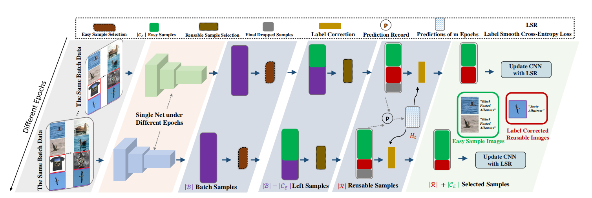

Introduction
---
Datasets and source code for our paper **CRSSC: Salvage Reusable Samples from Noisy Data for Robust Learning**


Network Architecture
---


Installation
---
After creating a virtual environment of python 3.5, run `pip install -r requirements.txt` to install all dependencies

How to use
---
The code is currently tested only on GPU.
- Data Preparation
  
    Download data into working directory and decompress them using
    ```
    wget https://web-fgvc-496-5089-sh.oss-cn-shanghai.aliyuncs.com/web-aircraft.tar.gz
    wget https://web-fgvc-496-5089-sh.oss-cn-shanghai.aliyuncs.com/web-bird.tar.gz
    wget https://web-fgvc-496-5089-sh.oss-cn-shanghai.aliyuncs.com/web-car.tar.gz
    tar -xvf web-aircraft.tar.gz
    tar -xvf web-bird.tar.gz
    tar -xvf web-car.tar.gz
    ```

- Source Code
    
    - If you want to train the whole model from beginning using the source code, please follow the subsequent steps.

        - Download dataset of `web-aircraft`/`web-bird`/`web-car` into the working directory as needed.
        - In `train.sh`
          - modify `CUDA_VISIBLE_DEVICES` to proper cuda device id.
          - modify `DATA_BASE` to the desired dataset and modify `N_CLASSES` accordingly.
          - modify `NET` to the desired backbone network.
        - Activate virtual environment (e.g. conda) and then run the script
            ```
            bash train.sh
            ```

- Demo

    - If you just want to do a quick test on the model and check the final recognition performance, please follow the subsequent steps.

        - Download one of the following trained models into `model/` using
            ```
            wget https://fg-crssc-sh.oss-cn-shanghai.aliyuncs.com/web-aircraft_bcnn_best_epoch_76.4776.pth
            wget https://fg-crssc-sh.oss-cn-shanghai.aliyuncs.com/web-bird_bcnn_best_epoch_77.4249.pth
            wget https://fg-crssc-sh.oss-cn-shanghai.aliyuncs.com/web-car_bcnn_best_epoch_76.6447.pth
            ```
        - Activate virtual environment (e.g. conda)
        - In `demo.sh`
          - modify `CUDA_VISIBLE_DEVICES` to proper cuda device id.
          - modify `DATA_BASE`, `N_CLASSES` and `NET` according to the model downloaded.
        - Run demo using `bash demo.sh`


Citation
---
If you find this useful in your research, please consider citing:
```
@inproceedings{sun2020crssc,
title={CRSSC: Salvage Reusable Samples from Noisy Data for Robust Learning},
author={Zeren Sun, Xian-Sheng Hua, Yazhou Yao, Xiu-Shen Wei, Guosheng Hu, Jian Zhang},
booktitle={ACM International Conference on Multimedia (ACM MM)},
year={2020}
}
```